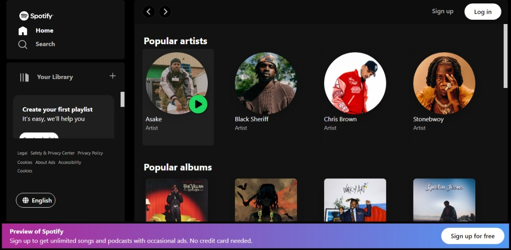

# Spotify Landing Page in React JS

## Overview

This project is part of the Codevixens Frontend Development Challenge (Day 5). It is a recreation of the Spotify landing page, built using React. It demonstrates how to structure a complex web page using React components, apply CSS styling, and implement responsive design principles.

## Features

- **Component-Based Structure**: The landing page is broken down into logical components (Header, Main Content, Footer) for better organization and maintainability.
- **CSS Styling**: Components are styled using CSS to match the visual design of the Spotify landing page.
- **Responsive Design (In Progressive)**: Media queries are used to ensure the landing page adapts seamlessly to different screen sizes.
- **Smooth Scrolling**: Interactive elements like smooth scrolling are implemented to enhance the user experience.

## Installation

1. Clone the repository:

```bash
git clone https://github.com/gideonagyage/Spotify-Landing-Page.git
```

2. Navigate to the project directory:

```bash
cd Spotify-Landing-Page
```

3. Install dependencies:

```bash
npm install
```

## Usage

1. Start the development server:

```bash
npm start
```

2. Open your browser and navigate to

```bash
http://localhost:3000.
```

## How it Works

The `SpotifyLandingPage` component is the main component that orchestrates the rendering of the landing page. It utilizes child components for each section:

1. **Header**: Renders the navigation bar, logo, and search bar.
2. **Main Content**: Contains the main sections of the landing page, such as featured artists, playlists, and recommendations.
3. **Footer**: Displays copyright information, links to other Spotify services, and social media links.

## Screenshot



<br> <br>

## Live Demo

Check out the live demo [here](https://spotify-landing-page-gold.vercel.app/).

## Key Concepts

1. **Component-Based Architecture**: Breaking down a complex UI into reusable and manageable components.
2. **CSS Styling**: Applying styles to components using CSS or CSS-in-JS libraries.
3. **Responsive Design (In Progress)**: Creating a website that adapts to different screen sizes and devices.
4. **Smooth Scrolling**: Implementing smooth transitions for scrolling to specific sections of the page.

## Contributing

Feel free to fork this repository and submit pull requests. Any contributions are welcome!

## License

This project is licensed under the MIT License.

## Acknowledgements

- Codevixens for organizing the challenge.
- Chinaza Igboanugo, Lois Bassey, and Oyinkansola Shoroye for their contributions and guidance.

Feel free to customize it further to fit your needs! If you have any specific details you'd like to add or change, let me know.
